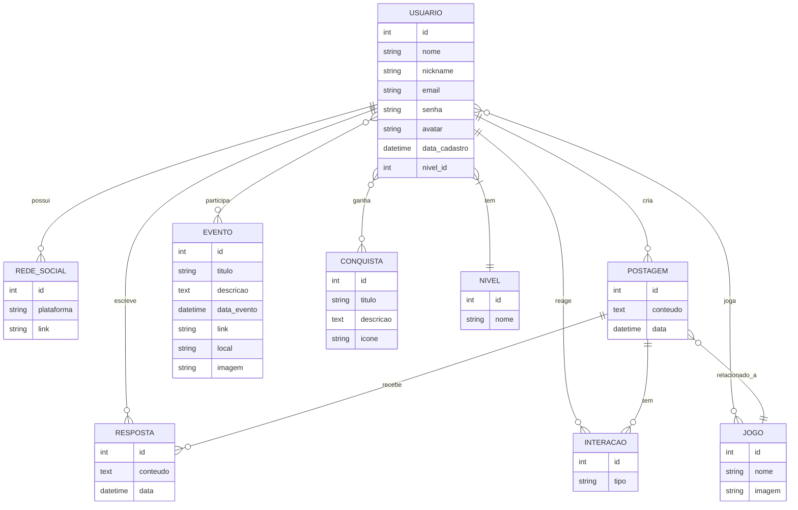
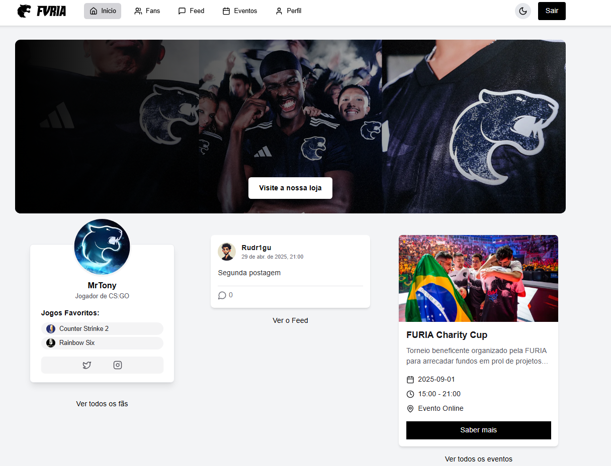
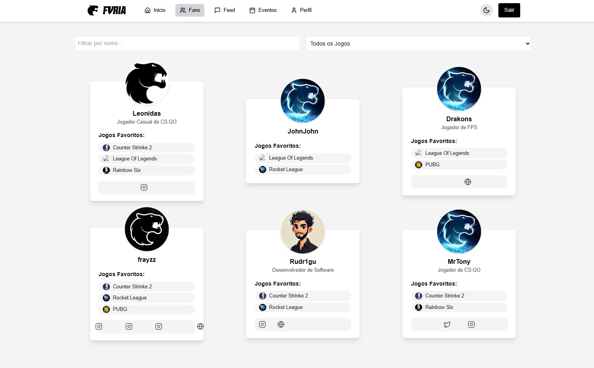
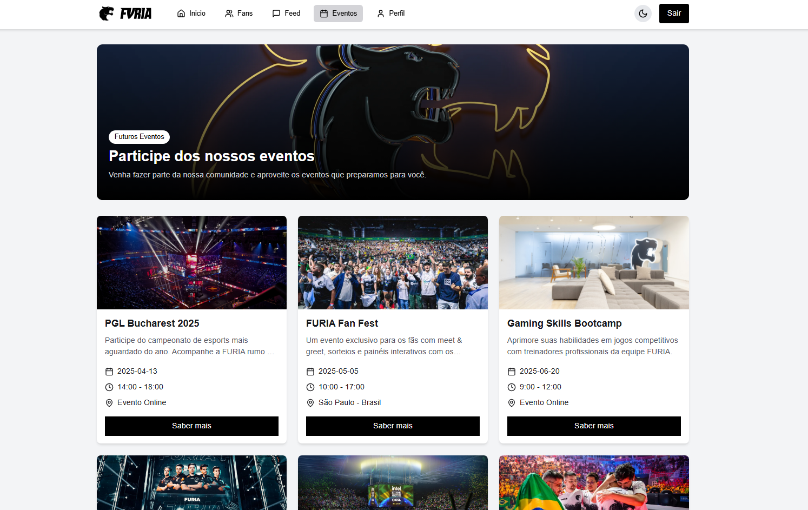
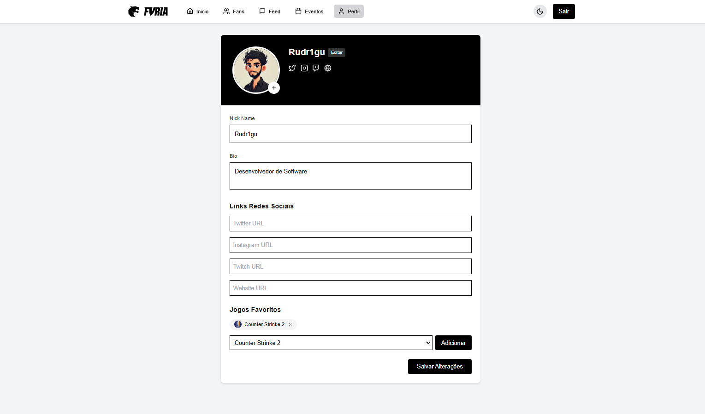

<table>
    <tr>
        <th style="width:35%; font-size:20px;"><a href="https://furia-fans.vercel.app/">Deploy - Furia Fans 🚀</a></th>
	    <th style="width:35%; font-size:20px;"><a href="https://docs.google.com/document/d/1_QlS5TYwq8F9tFdWsrCBjOkJOK-gvLrjTQP5OPQafYc/edit?usp=sharing">📑 Escopo do Projeto </a></th>
        <th style="width:35%; font-size:20px;"><a href="https://api-dashboard-furia.onrender.com/swagger-ui">🧩 SpringDoc - SwaggerUI </a></th>
    </tr>
</table>
 

# Furia Fans

Plataforma interativa criada para os fãs e torcedores da equipe FURIA, oferecendo uma rede social exclusiva com recursos de feed, eventos, perfis personalizados e muito mais.

---

## Objetivo

O **Furia Fans** foi desenvolvido para conectar os torcedores da FURIA entre si e com a própria organização. Através da plataforma, os usuários podem:

- Interagir com postagens no feed (criar, responder e deletar).
- Acompanhar os próximos eventos da equipe.
- Visualizar e editar seus perfis, incluindo redes sociais e jogos favoritos.
- Filtrar usuários por jogos preferidos.
- Alternar entre temas **claro** e **escuro**.

Além disso, a plataforma ajuda a FURIA a conhecer melhor seu público-alvo.

> Projeto desenvolvido para o processo seletivo de Assistente de Engenharia de Software, com o objetivo de demonstrar minhas habilidades técnicas em frontend e backend.

---

## Tecnologias Utilizadas

###  Backend

#### Repositório: [API-dashboard-furia](https://github.com/rudr1gu/api-dashboard-furia)

- Java 17
- Spring Boot
- Spring Security (JWT)
- Spring Data JPA
- Spring Docs (Swagger UI)

###  Banco de Dados

- MySQL (desenvolvimento)
- PostgreSQL (produção)

###  Frontend

- ReactJS com TypeScript
- Tailwind CSS

###  Clound
- Render para o backend e banco de dados
- Vercel Para o frontend

---

## Futuras Implementações

- Gamificação com níveis: Bronze, Ouro e Platina, conforme engajamento.
- Transformar a aplicação em PWA e integrar notificações via Firebase.
- Refatoração do backend com uso de DTOs e melhor tratamento de exceções.

---

## 📷 Demonstrações

---

## Autor

**Rodrigo Santos Silva**  
Desenvolvedor Fullstack  
📧 rodrigo.santos.ii@hotmail.com  
🔗 [LinkedIn](https://www.linkedin.com/in/rudr1gu) | [GitHub](https://github.com/rudr1gu) | [Portifólio](https://rudr1gu.vercel.app)

---

## 📝 Licença

Este projeto está sob a licença MIT. Veja o arquivo [LICENSE](LICENSE) para mais detalhes.
